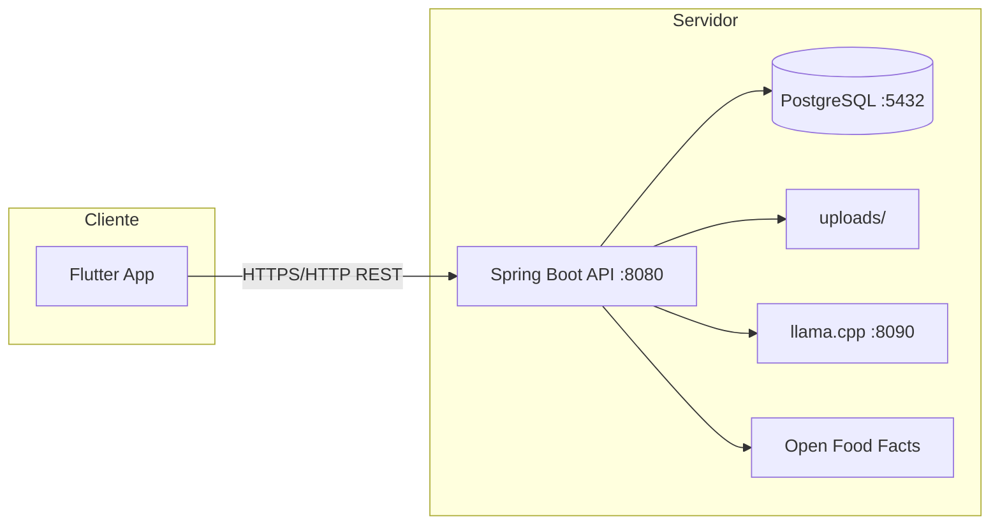
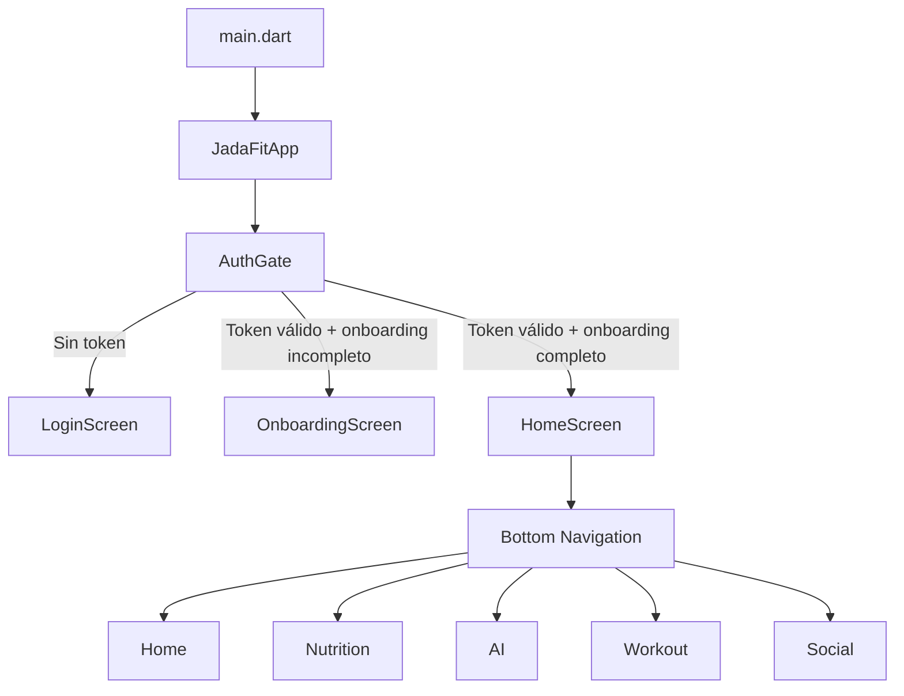

# Documentación centralizada de JADA FIT

Este documento es la fuente única de la documentación técnica principal de JADA FIT. Cubre toda la aplicación: frontend Flutter, backend Spring Boot, integración, arquitectura, entorno local y estado de desarrollo.

## 1. Resumen del producto

JADA FIT es una plataforma fitness integral diseñada para acompañar al usuario en nutrición, entrenamiento, progreso físico, acompañamiento por IA y una capa social ligera.

### Misión

Permitir que los usuarios entrenen, planifiquen comidas, controlen su estado físico y se motiven con una experiencia personalizada basada en datos y recomendaciones inteligentes.

### Alcance

- App móvil/web construida en Flutter.
- API REST backend con Spring Boot y PostgreSQL.
- Autenticación con JWT.
- Chats de IA con contexto del usuario.
- Rutinas, comidas, progreso y retos sociales.
- Internacionalización español/inglés.

## 2. Visión de la arquitectura

JADA FIT está diseñada como una aplicación cliente-servidor:

- **Frontend**: Flutter consume la API REST y gestiona la UI, estado local y preferencias.
- **Backend**: Spring Boot expone la lógica de negocio, persistencia y accesos a servicios externos.
- **Base de datos**: PostgreSQL almacena usuarios, perfiles, rutinas, comidas, posts y más.
- **Servicios externos**: llama.cpp para IA, Open Food Facts para alimentos.

### Arquitectura de alto nivel



### Principios clave

- Separación de responsabilidades entre frontend y backend.
- Autenticación stateless mediante JWT con validación de sesiones.
- Diseño modular por dominios funcionales.
- Uso de servicios externos solo cuando es necesario para datos de alimentos e IA.

## 3. Backend

### Stack principal

- Java 21
- Spring Boot 4
- Spring Data JPA + Hibernate
- PostgreSQL 16
- Spring Security + JWT
- SpringDoc OpenAPI (Swagger)
- Spring Mail para recuperación de contraseña

### Estructura de paquetes

```
es.jadafit.jadafit_api/
├── config/        # Security, OpenAPI, CORS, recursos estáticos, seeders
├── controller/    # Controladores REST
├── dto/           # Request/response DTOs
├── model/         # Entidades JPA
├── repository/    # Repositorios Spring Data
├── security/      # JwtUtils, filtros y manejo de tokens
├── service/       # Lógica del negocio
└── exception/     # Excepciones y manejo global
```

### Módulos de negocio

| Módulo | Responsabilidad |
|--------|-----------------|
| Auth / Usuarios | Registro, login, perfil, sesiones, reset password |
| Onboarding | Captura inicial de datos físicos y objetivos |
| Fitness | Perfil físico, logs de progreso y métricas |
| Nutrition | Comidas, metas calóricas, ingesta diaria y recetas |
| Foods | Catálogo de alimentos, cache local + Open Food Facts |
| Workout | Rutinas, ejercicios y registros de entrenamiento |
| AI | Chat contextual con recomendaciones deportivas y nutricionales |
| Social | Posts, stories, follows, retos y actividad social |
| Upload | Gestión de imágenes de usuario, posts e historias |

### Seguridad

- Rutas públicas: `POST /api/users/register`, `POST /api/users/login`, `POST /api/users/forgot-password`, `POST /api/users/reset-password`, `GET /api/uploads/**`
- Resto de `/api/**`: JWT obligatorio.
- Token JWT incluye `sid` para validar sesión en la base de datos.
- Expiración del token configurable (por defecto 24 horas).

## 4. Frontend

### Stack principal

- Flutter 3 con Dart 3.11
- Provider para estado
- `flutter_secure_storage` para JWT y datos sensibles
- `shared_preferences` para tema, idioma y unidades de medida
- L10n con archivos ARB para español e inglés

### Estructura del código

```
lib/
├── main.dart
├── app.dart
├── core/           # Config, servicios, widgets compartidos
├── l10n/           # Traducciones
└── features/       # Módulos funcionales
    └── <feature>/  # UI, providers y servicios HTTP
```

### Módulos principales

| Módulo | Funcionalidad |
|--------|---------------|
| Auth | Registro, login, recuperación de contraseña |
| Onboarding | Captura de datos iniciales de usuario |
| Home | Resumen de actividad, recomendaciones y métricas |
| Nutrition | Registro de comidas, calculadora de macros, recetas |
| Workout | Rutinas, ejercicios, historial de entrenamiento |
| Fitness Profile | Datos físicos y progreso |
| AI | Chat y recomendaciones personalizadas |
| Social | Feed, explore, posts, stories, retos |
| Settings | Preferencias, tema, idioma, notificaciones |

### Flujo de navegación



### Conexión con la API

- Base URL definida en `lib/core/config/api_config.dart`.
- En Android emulador se usa `http://10.0.2.2:8080/api`.
- En web se usa `/api` para que la app funcione con el mismo host.
- Cada servicio HTTP añade manualmente el header `Authorization: Bearer <token>`.

## 5. Integración frontend-backend

| Función | Endpoint backend |
|--------|------------------|
| Login | `POST /api/users/login` |
| Cargar perfil | `GET /api/users/me` |
| Nutrición diaria | `GET /api/nutrition/day` |
| Crear rutina | `POST /api/routines` |
| Chat IA | `POST /api/ai/chat` |
| Feed social | `GET /api/social/posts/feed` |
| Crear post | `POST /api/social/posts` |
| Crear historia | `POST /api/social/stories` |
| Retos | `POST /api/challenges` |

## 6. Desarrollo local

### Requisitos

- Java 21
- Docker
- Flutter SDK compatible con Dart 3.11
- Maven incluido (`mvnw`, `mvnw.cmd`)
- Git

### Backend local

1. Inicia la base de datos:

```powershell
cd e:\Proyectos\JADA-Fit\jadafit-api
docker compose up -d
```

2. Crea `src/main/resources/application-local.properties` con:

```properties
DB_URL=jdbc:postgresql://localhost:5432/postgres
DB_USER=postgres
DB_PASSWORD=jadaFit-2025
SEC_KEY=<clave-secreta-jwt>

MAIL_HOST=smtp.mailtrap.io
MAIL_PORT=587
MAIL_USERNAME=
MAIL_PASSWORD=
```

3. Arranca la API:

```powershell
cd e:\Proyectos\JADA-Fit\jadafit-api
.\mvnw.cmd spring-boot:run
```

4. URLs de prueba:

- API: `http://localhost:8080/api`
- Swagger UI: `http://localhost:8080/swagger-ui.html`
- OpenAPI: `http://localhost:8080/v3/api-docs`

### Frontend local

```powershell
cd e:\Proyectos\JADA-Fit\jadafit-front
flutter pub get
flutter gen-l10n
flutter run
```

### Configuración de la API en el frontend

- Web: `baseUrl = '/api'`
- Android emulador: `baseUrl = 'http://10.0.2.2:8080/api'`
- Dispositivo físico: usar la IP local de la máquina.

## 7. Estado de implementación (junio 2026)

### Completado

- Autenticación por correo electrónico.
- Onboarding y perfil físico.
- Nutrición básica y registro de comidas.
- Gestión de rutinas y catálogo de ejercicios.
- Chat de IA con contexto del usuario.
- Estructura social básica: feed, stories, perfiles y retos.

### Parcial

- Social UI con interacción incompleta (likes, comentarios, lista de seguidores).
- i18n en progreso.
- Sincronización de rutinas completadas solo local.
- Integraciones con wearables como stub.

### No implementado

- OAuth.
- Mensajería directa.
- Gamificación avanzada.
- Despliegue en producción documentado.

## 8. Prioridades y próximos pasos

1. Completar la experiencia social.
2. Sincronizar el estado de rutinas completadas con el backend.
3. Terminar la migración de textos a l10n.
4. Unificar el cliente HTTP del frontend.
5. Documentar la configuración y despliegue en producción.

## 9. Mantenimiento de la documentación

Este archivo es la referencia principal. Mantenerlo actualizado cada vez que se añada o cambie una feature crítica del sistema.

---

> Notas: los archivos `arquitectura.md`, `guia-desarrollo.md` y `estado-implementacion.md` pueden mantenerse como referencias históricas, pero la documentación actualizada y centralizada está en este `README.md`.
