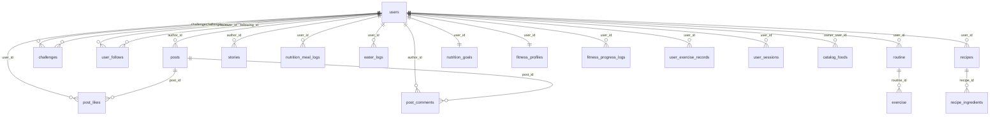
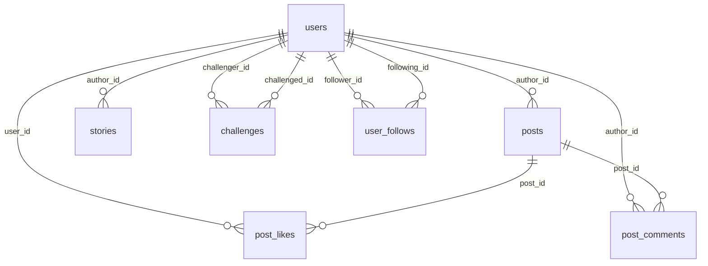
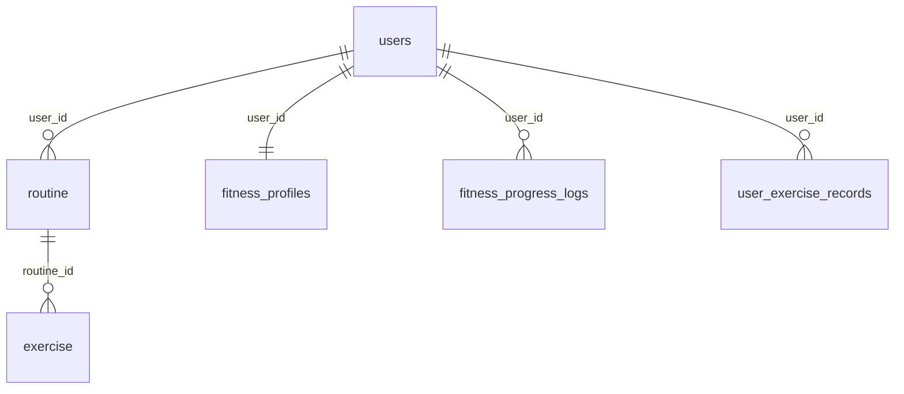
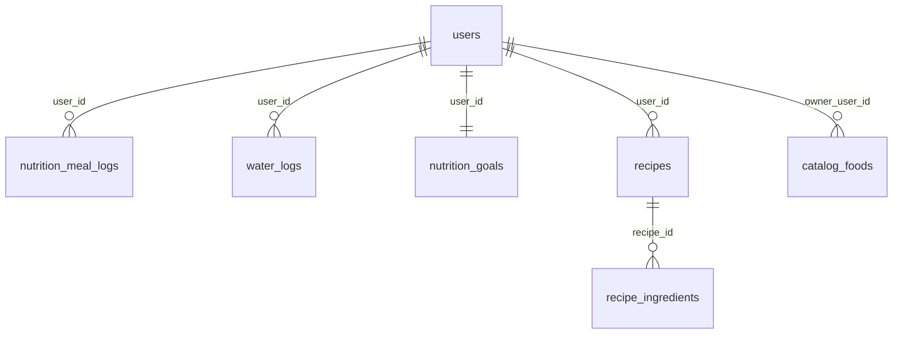
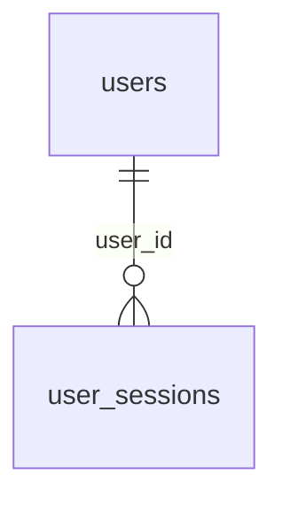

# Esquema de Base de Datos — JADA-Fit

## Leyenda

<table>
<tr><th>Símbolo</th><th>Significado</th></tr>
<tr><td><code>||--o{</code></td><td>One (FK owner) a Many (inverse)</td></tr>
<tr><td><code>||--||</code></td><td>One a One</td></tr>
<tr><td><code>}o--o{</code></td><td>Many a Many (no existe aquí)</td></tr>
</table>

---

## 1. Diagrama General

---

## 2. Diagramas por dominio

### 2.1 Social

### 2.2 Fitness

### 2.3 Nutrición

### 2.4 Sesiones

---

## 3. Catálogo completo de tablas

### 3.1 `users`
| Columna | Tipo | Restricciones | Descripción |
|---------|------|--------------|-------------|
| `id` | UUID | PK | |
| `username` | VARCHAR(255) | NOT NULL, UNIQUE | |
| `email` | VARCHAR(255) | NOT NULL, UNIQUE | |
| `password_hash` | VARCHAR(255) | NOT NULL | BCrypt |
| `onboarding_completed` | BOOLEAN | NOT NULL, DEFAULT false | |
| `bio` | VARCHAR(500) | | |
| `profile_picture_url` | VARCHAR(255) | | |
| `created_at` | TIMESTAMP | NOT NULL | |
| `share_progress` | BOOLEAN | NOT NULL, DEFAULT true | |
| `password_reset_token` | VARCHAR(36) | | |
| `password_reset_token_expiry` | TIMESTAMP | | |
| `version` | BIGINT | NOT NULL, DEFAULT 0 | Optimistic locking |

### 3.2 `posts`
| Columna | Tipo | Restricciones | FK |
|---------|------|--------------|-----|
| `id` | UUID | PK | |
| `author_id` | UUID | NOT NULL | → users(id) |
| `image_url` | VARCHAR(255) | NOT NULL | |
| `caption` | TEXT | | |
| `created_at` | TIMESTAMP | NOT NULL | |
| `version` | BIGINT | NOT NULL, DEFAULT 0 | |

### 3.3 `post_likes`
| Columna | Tipo | Restricciones | FK |
|---------|------|--------------|-----|
| `id` | UUID | PK | |
| `post_id` | UUID | NOT NULL | → posts(id) |
| `user_id` | UUID | NOT NULL | → users(id) |
| `created_at` | TIMESTAMP | NOT NULL | |
| `version` | BIGINT | NOT NULL, DEFAULT 0 | |

**UK:** `(post_id, user_id)`

### 3.4 `post_comments`
| Columna | Tipo | Restricciones | FK |
|---------|------|--------------|-----|
| `id` | UUID | PK | |
| `post_id` | UUID | NOT NULL | → posts(id) |
| `author_id` | UUID | NOT NULL | → users(id) |
| `content` | TEXT | NOT NULL | |
| `created_at` | TIMESTAMP | NOT NULL | |
| `version` | BIGINT | NOT NULL, DEFAULT 0 | |

### 3.5 `routine`
| Columna | Tipo | Restricciones | FK |
|---------|------|--------------|-----|
| `id` | BIGINT | PK (auto-increment) | |
| `user_id` | UUID | NOT NULL | → users(id) |
| `name` | VARCHAR(255) | NOT NULL | |
| `description` | VARCHAR(1000) | | |
| `target_goal` | VARCHAR(255) | | |
| `is_completed` | BOOLEAN | DEFAULT false | |
| `completed_at` | TIMESTAMP | | |
| `version` | BIGINT | NOT NULL, DEFAULT 0 | |

### 3.6 `exercise`
| Columna | Tipo | Restricciones | FK |
|---------|------|--------------|-----|
| `id` | BIGINT | PK (auto-increment) | |
| `routine_id` | BIGINT | | → routine(id) |
| `name` | VARCHAR(255) | NOT NULL | |
| `description` | VARCHAR(1000) | | |
| `sets` | INTEGER | | |
| `reps` | INTEGER | | |
| `duration_seconds` | INTEGER | | |
| `is_completed` | BOOLEAN | DEFAULT false | |
| `version` | BIGINT | NOT NULL, DEFAULT 0 | |

### 3.7 `catalog_exercise`
| Columna | Tipo | Restricciones |
|---------|------|--------------|
| `id` | BIGINT | PK (auto-increment) |
| `name` | VARCHAR(255) | NOT NULL |
| `description` | VARCHAR(1000) | |
| `benefits` | VARCHAR(1000) | |
| `video_url` | VARCHAR(255) | |
| `version` | BIGINT | NOT NULL, DEFAULT 0 |

### 3.8 `fitness_profiles`
| Columna | Tipo | Restricciones | FK |
|---------|------|--------------|-----|
| `id` | UUID | PK | |
| `user_id` | UUID | NOT NULL, UNIQUE | → users(id) |
| `weight` | NUMERIC | | kg |
| `height` | INTEGER | | cm |
| `date_of_birth` | DATE | | |
| `gender` | VARCHAR(255) | | `MALE`, `FEMALE`, `OTHER` |
| `goal` | VARCHAR(255) | | `LOSE_WEIGHT`, `GAIN_MUSCLE`, etc. |
| `body_fat` | NUMERIC | | % |
| `muscle_mass` | NUMERIC | | kg |
| `updated_at` | TIMESTAMP | NOT NULL | |
| `version` | BIGINT | NOT NULL, DEFAULT 0 | |

### 3.9 `fitness_progress_logs`
| Columna | Tipo | Restricciones | FK |
|---------|------|--------------|-----|
| `id` | UUID | PK | |
| `user_id` | UUID | NOT NULL | → users(id) |
| `weight` | NUMERIC | | |
| `body_fat` | NUMERIC | | |
| `muscle_mass` | NUMERIC | | |
| `logged_at` | TIMESTAMP | NOT NULL | |
| `version` | BIGINT | NOT NULL, DEFAULT 0 | |

### 3.10 `user_exercise_records`
| Columna | Tipo | Restricciones | FK |
|---------|------|--------------|-----|
| `id` | UUID | PK | |
| `user_id` | UUID | NOT NULL | → users(id) |
| `exercise_name` | VARCHAR(255) | NOT NULL | |
| `max_weight` | NUMERIC | NOT NULL | |
| `updated_at` | TIMESTAMP | NOT NULL | |
| `version` | BIGINT | NOT NULL, DEFAULT 0 | |

**UK:** `(user_id, exercise_name)`

### 3.11 `nutrition_meal_logs`
| Columna | Tipo | Restricciones | FK |
|---------|------|--------------|-----|
| `id` | UUID | PK | |
| `user_id` | UUID | NOT NULL | → users(id) |
| `external_food_id` | VARCHAR(255) | | |
| `food_name` | VARCHAR(255) | NOT NULL | |
| `food_source` | VARCHAR(255) | | `USER`, `SYSTEM`, `BARCODE`, `OPEN_FOOD_FACTS` |
| `meal_type` | VARCHAR(255) | NOT NULL | `BREAKFAST`, `LUNCH`, `DINNER`, `SNACK` |
| `quantity_grams` | NUMERIC | NOT NULL | |
| `calories` | NUMERIC | NOT NULL | |
| `protein` | NUMERIC | NOT NULL | |
| `carbs` | NUMERIC | NOT NULL | |
| `fats` | NUMERIC | NOT NULL | |
| `logged_at` | TIMESTAMP | NOT NULL | |
| `version` | BIGINT | NOT NULL, DEFAULT 0 | |

### 3.12 `water_logs`
| Columna | Tipo | Restricciones | FK |
|---------|------|--------------|-----|
| `id` | UUID | PK | |
| `user_id` | UUID | NOT NULL | → users(id) |
| `amount_ml` | NUMERIC | NOT NULL | |
| `logged_at` | TIMESTAMP | NOT NULL | |
| `version` | BIGINT | NOT NULL, DEFAULT 0 | |

### 3.13 `nutrition_goals`
| Columna | Tipo | Restricciones | FK |
|---------|------|--------------|-----|
| `id` | UUID | PK | |
| `user_id` | UUID | NOT NULL, UNIQUE | → users(id) |
| `calories_target` | NUMERIC | NOT NULL | |
| `protein_target` | NUMERIC | NOT NULL | |
| `carbs_target` | NUMERIC | NOT NULL | |
| `fats_target` | NUMERIC | NOT NULL | |
| `updated_at` | TIMESTAMP | NOT NULL | |
| `version` | BIGINT | NOT NULL, DEFAULT 0 | |

### 3.14 `recipes`
| Columna | Tipo | Restricciones | FK |
|---------|------|--------------|-----|
| `id` | UUID | PK | |
| `user_id` | UUID | NOT NULL | → users(id) |
| `name` | VARCHAR(255) | NOT NULL | |
| `servings` | INTEGER | | |
| `created_at` | TIMESTAMP | NOT NULL | |
| `updated_at` | TIMESTAMP | NOT NULL | |
| `version` | BIGINT | NOT NULL, DEFAULT 0 | |

### 3.15 `recipe_ingredients`
| Columna | Tipo | Restricciones | FK |
|---------|------|--------------|-----|
| `id` | UUID | PK | |
| `recipe_id` | UUID | NOT NULL | → recipes(id) |
| `food_name` | VARCHAR(255) | NOT NULL | |
| `quantity_grams` | NUMERIC | NOT NULL | |
| `calories_per_100g` | NUMERIC | NOT NULL | |
| `protein_per_100g` | NUMERIC | NOT NULL | |
| `carbs_per_100g` | NUMERIC | NOT NULL | |
| `fats_per_100g` | NUMERIC | NOT NULL | |
| `version` | BIGINT | NOT NULL, DEFAULT 0 | |

### 3.16 `catalog_foods`
| Columna | Tipo | Restricciones | FK |
|---------|------|--------------|-----|
| `id` | UUID | PK | |
| `owner_user_id` | UUID | | → users(id) (nullable) |
| `external_food_id` | VARCHAR(255) | | |
| `barcode` | VARCHAR(255) | | |
| `name` | VARCHAR(255) | NOT NULL | |
| `brand` | VARCHAR(255) | | |
| `source` | VARCHAR(255) | NOT NULL | `USER`, `SYSTEM`, `BARCODE`, `OPEN_FOOD_FACTS` |
| `calories_per_100g` | NUMERIC | NOT NULL | |
| `protein_per_100g` | NUMERIC | NOT NULL | |
| `carbs_per_100g` | NUMERIC | NOT NULL | |
| `fats_per_100g` | NUMERIC | NOT NULL | |
| `created_at` | TIMESTAMP | NOT NULL | |
| `updated_at` | TIMESTAMP | NOT NULL | |
| `version` | BIGINT | NOT NULL, DEFAULT 0 | |

### 3.17 `challenges`
| Columna | Tipo | Restricciones | FK |
|---------|------|--------------|-----|
| `id` | UUID | PK | |
| `challenger_id` | UUID | NOT NULL | → users(id) |
| `challenged_id` | UUID | NOT NULL | → users(id) |
| `exercise_name` | VARCHAR(255) | NOT NULL | |
| `status` | VARCHAR(255) | NOT NULL | `PENDING`, `ACCEPTED`, `COMPLETED`, `DECLINED`, `CANCELED` |
| `challenger_weight` | NUMERIC(8,3) | | |
| `challenged_weight` | NUMERIC(8,3) | | |
| `created_at` | TIMESTAMP | NOT NULL | |
| `version` | BIGINT | NOT NULL, DEFAULT 0 | |

### 3.18 `user_follows`
| Columna | Tipo | Restricciones | FK |
|---------|------|--------------|-----|
| `id` | UUID | PK | |
| `follower_id` | UUID | NOT NULL | → users(id) |
| `following_id` | UUID | NOT NULL | → users(id) |
| `created_at` | TIMESTAMP | NOT NULL | |
| `version` | BIGINT | NOT NULL, DEFAULT 0 | |

**UK:** `(follower_id, following_id)`

### 3.19 `stories`
| Columna | Tipo | Restricciones | FK |
|---------|------|--------------|-----|
| `id` | UUID | PK | |
| `author_id` | UUID | NOT NULL | → users(id) |
| `image_url` | VARCHAR(255) | NOT NULL | |
| `created_at` | TIMESTAMP | NOT NULL | |
| `expires_at` | TIMESTAMP | NOT NULL | |
| `version` | BIGINT | NOT NULL, DEFAULT 0 | |

### 3.20 `user_sessions`
| Columna | Tipo | Restricciones | FK |
|---------|------|--------------|-----|
| `id` | UUID | PK | |
| `user_id` | UUID | NOT NULL | → users(id) |
| `session_id` | VARCHAR(36) | NOT NULL, UNIQUE | |
| `created_at` | TIMESTAMP | NOT NULL | |
| `expires_at` | TIMESTAMP | NOT NULL | |
| `device_info` | VARCHAR(255) | | |
| `is_active` | BOOLEAN | NOT NULL, DEFAULT true | |
| `version` | BIGINT | NOT NULL, DEFAULT 0 | |

---

## 4. Enumeraciones

| Enum | Valores | Columna |
|------|---------|---------|
| `Gender` | `MALE`, `FEMALE`, `OTHER` | fitness_profiles.gender |
| `FitnessGoal` | `LOSE_WEIGHT`, `GAIN_MUSCLE`, `MAINTAIN`, `IMPROVE_ENDURANCE`, `GENERAL_FITNESS` | fitness_profiles.goal |
| `MealType` | `BREAKFAST`, `LUNCH`, `DINNER`, `SNACK` | nutrition_meal_logs.meal_type |
| `FoodSource` | `USER`, `SYSTEM`, `BARCODE`, `OPEN_FOOD_FACTS` | nutrition_meal_logs.food_source, catalog_foods.source |
| `ChallengeStatus` | `PENDING`, `ACCEPTED`, `COMPLETED`, `DECLINED`, `CANCELED` | challenges.status |

---

## 5. Índices

| Tabla | Índice | Columna(s) |
|-------|--------|------------|
| posts | `idx_posts_author_id` | `author_id` |
| post_comments | `idx_post_comments_post_id` | `post_id` |
| post_comments | `idx_post_comments_author_id` | `author_id` |
| challenges | `idx_challenges_challenger_id` | `challenger_id` |
| challenges | `idx_challenges_challenged_id` | `challenged_id` |
| user_follows | `idx_user_follows_following_id` | `following_id` |
| user_sessions | `idx_user_sessions_user_id` | `user_id` |
| water_logs | `idx_water_logs_user_id` | `user_id` |
| nutrition_meal_logs | `idx_nutrition_meal_logs_user_id` | `user_id` |
| recipes | `idx_recipes_user_id` | `user_id` |
| recipe_ingredients | `idx_recipe_ingredients_recipe_id` | `recipe_id` |
| stories | `idx_stories_author_id` | `author_id` |
| fitness_progress_logs | `idx_fitness_progress_logs_user_id` | `user_id` |
| catalog_foods | `idx_catalog_foods_name` | `name` |
| catalog_foods | `idx_catalog_foods_barcode` | `barcode` |
| catalog_foods | `idx_catalog_foods_owner_user_id` | `owner_user_id` |

---

## 6. Unique Constraints

| Tabla | Columnas |
|-------|----------|
| users | `username` |
| users | `email` |
| user_sessions | `session_id` |
| fitness_profiles | `user_id` |
| nutrition_goals | `user_id` |
| post_likes | `(post_id, user_id)` |
| user_follows | `(follower_id, following_id)` |
| user_exercise_records | `(user_id, exercise_name)` |
