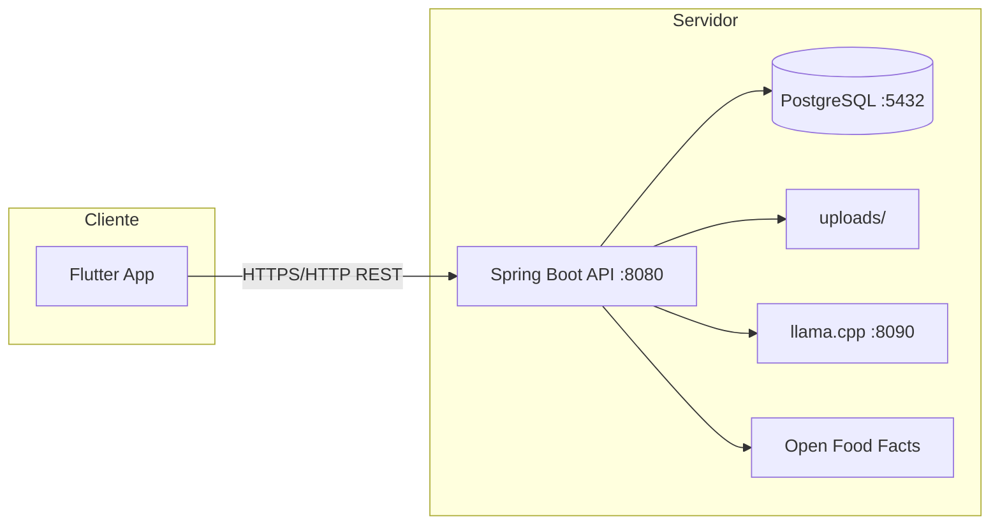
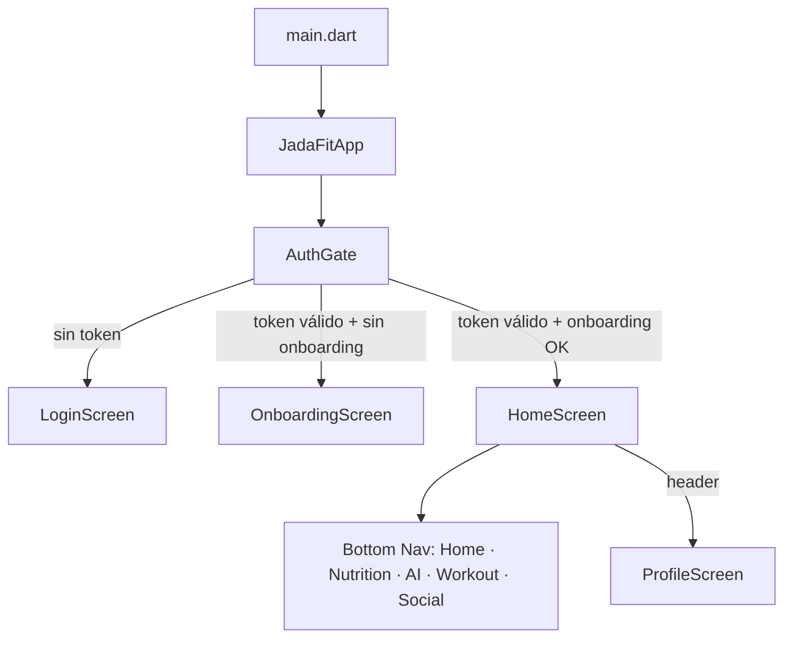

# Arquitectura del sistema

## Visión general

JADA FIT es una aplicación cliente-servidor: el frontend Flutter consume una API REST Spring Boot. La autenticación es stateless con JWT, validado contra sesiones persistidas en base de datos.



En **web**, el backend puede servir el build de Flutter (`jadafit-front/build/web/`) y la app usa `/api` como base URL (mismo origen).

## Backend (`jadafit-api`)

### Stack

- Java 21, Spring Boot 4.0.6
- Spring Data JPA + Hibernate → PostgreSQL 16
- Spring Security + JWT (jjwt)
- SpringDoc OpenAPI (Swagger)
- Spring Mail (reset de contraseña)

### Estructura de paquetes

```
es.jadafit.jadafit_api/
├── config/        # Security, OpenAPI, CORS, recursos estáticos, seeders
├── controller/    # 18 controladores REST
├── dto/           # Request/response DTOs
├── model/         # Entidades JPA (25+)
├── repository/    # Spring Data repositories
├── security/      # JwtUtils, JwtAuthenticationFilter
├── service/       # Lógica de negocio
└── exception/     # Excepciones + GlobalExceptionHandler
```

### Módulos de negocio

| Módulo | Responsabilidad |
|--------|-----------------|
| **Users / Auth** | Registro, login, sesiones (máx. 10), perfil, privacidad, reset password |
| **Onboarding** | Perfil físico inicial + primer registro de progreso |
| **Fitness** | Perfil físico y logs históricos (peso, grasa, músculo) |
| **Nutrition** | Comidas, objetivos (TDEE Mifflin-St Jeor), agua, recetas |
| **Foods** | Catálogo local + Open Food Facts + alimentos custom del usuario |
| **Workout** | Rutinas con ejercicios anidados, catálogo global de ejercicios |
| **AI** | Chat con contexto del usuario (macros, perfil) vía LLM local |
| **Social** | Follows, posts, likes, comentarios, stories (24h), retos (piques) |
| **Upload** | Imágenes de perfil, posts e historias |

### Entidades principales

```
User
├── FitnessProfile (1:1)
├── NutritionGoal (1:1)
├── FitnessProgressLog (*)
├── NutritionMealLog (*)
├── WaterLog (*)
├── Recipe (*) → RecipeIngredient (*)
├── Routine (*) → Exercise (*)
├── Post (*) → PostLike, PostComment
├── Story (*)
├── UserFollow (grafo follower/following)
├── Challenge (challenger ↔ challenged)
└── UserExerciseRecord (*)
```

### Seguridad

- Rutas públicas: `POST /api/users/register|login|forgot-password|reset-password`, `GET /api/uploads/**`
- Resto de `/api/**`: JWT obligatorio
- El token incluye claim `sid` (session id) validado en tabla `user_sessions`
- Expiración JWT: 24 h (configurable)

## Frontend (`jadafit-front`)

### Stack

- Flutter / Dart 3.11
- Provider (`AiProvider`, `SettingsProvider`)
- HTTP directo por servicio (sin capa repository)
- `flutter_secure_storage` para JWT y sesiones de chat IA
- `shared_preferences` para tema, idioma y unidades
- l10n con ARB (es/en)

### Estructura

```
lib/
├── main.dart, app.dart
├── core/           # Red, tema, storage, config, widgets compartidos
├── l10n/           # Traducciones
└── features/       # Un módulo por dominio
    └── <feature>/
        ├── data/models/
        ├── data/services/    # Llamadas HTTP
        └── presentation/     # screens, widgets, providers
```

### Módulos frontend

| Módulo | Pantallas principales |
|--------|----------------------|
| auth | AuthGate, Login, Register, Forgot/Reset password |
| onboarding | OnboardingScreen |
| home | HomeScreen + widgets de dashboard |
| nutrition | Nutrition, comidas, recetas, barcode, alimentos custom |
| workout | Rutinas, detalle, crear, biblioteca de ejercicios |
| fitness_profile | Perfil físico, progreso, calendario, logs |
| ai | Chat con historial de sesiones |
| social | Feed, explore, perfiles, posts, stories, piques |
| profile | Cuenta, privacidad, logout |
| settings | Tema, idioma, unidades, notificaciones |

### Flujo de navegación



### Integración con la API

- Base URL: `lib/core/config/api_config.dart`
  - Web: `/api`
  - Android emulador: `http://10.0.2.2:8080/api`
- Rutas: `lib/core/network/api_endpoints.dart`
- Cada `*_service.dart` añade `Authorization: Bearer <token>` manualmente
- Subida de imágenes: `UploadService` → `POST /api/upload/image`

## Comunicación front ↔ back

| Acción frontend | Endpoint backend |
|-----------------|------------------|
| Login | `POST /api/users/login` |
| Cargar perfil | `GET /api/users/me` |
| Resumen nutrición del día | `GET /api/nutrition/day?date=` |
| Crear rutina | `POST /api/routines` |
| Chat IA | `POST /api/ai/chat` |
| Feed social | `GET /api/social/posts/feed` |
| Crear post | `POST /api/social/posts` + upload previo |
| Reto (pique) | `POST /api/challenges` |

## Servicios externos

| Servicio | Uso |
|----------|-----|
| **Open Food Facts** | Búsqueda y barcode de alimentos |
| **llama.cpp** | Modelo local Qwen2.5 para el coach IA |
| **Mailtrap/SMTP** | Emails de recuperación de contraseña (opcional) |

## Decisiones de diseño relevantes

1. **Sin capa repository en Flutter** — los servicios llaman HTTP directamente; más simple pero con lógica de token duplicada.
2. **Completado de rutinas solo en local** — `CompletedStorageService` en secure storage; no sincroniza con el backend aún.
3. **Social: API completa, UI parcial** — likes, comentarios y listas de seguidores existen en backend y servicios front, pero la UI no los conecta del todo.
4. **IA con contexto** — el backend inyecta objetivos nutricionales y perfil físico en el prompt del LLM.
